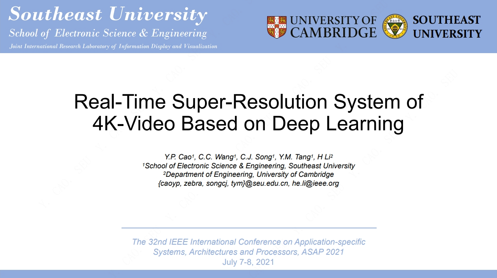
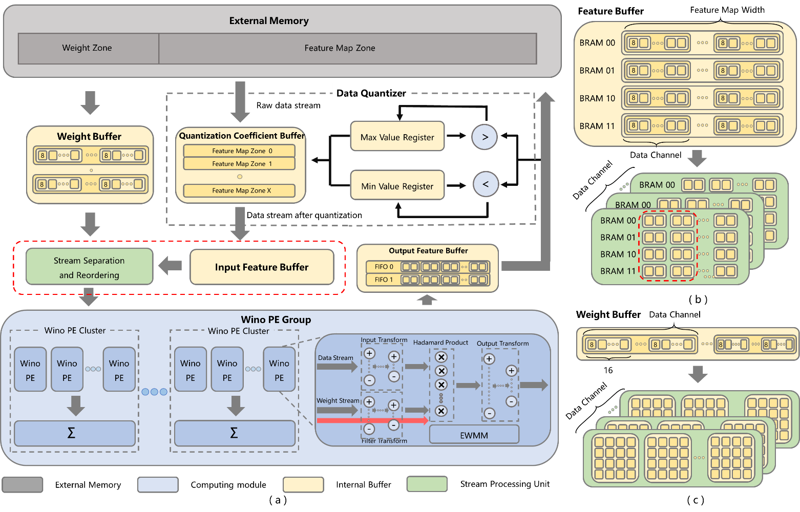








# 👋 About Me

👨‍💼 I'm now working at EDA R&D Center of [Hisilicon Tech. Co., Ltd.](https://www.hisilicon.com/en/about-us/company/) , which is one of the most competitive fabless semiconductors company all over the world (Biggest IC Design House in China), leading a lithography modeling group. 

👨‍🎓 I graduated from [School of Electronic Science & Engineering](https://electronic.seu.edu.cn/dz_en/main.psp), Southeast University (SEU) with a bachelor's degree (2018) and a master's degree (2021), advised by Prof. [Tang Yongming (汤勇明)](https://electronic.seu.edu.cn/tym_en/list.htm). I also collaborate with [Wang Chengcheng (王成诚)]() working at [T-Head](https://www.t-head.cn/) , [Li He (李鹤)](https://display.seu.edu.cn/2023/0130/c44838a434097/page.htm) from [University of Cambridge](https://www.cam.ac.uk/) , and [Yu Feng (俞峰)]() from [NUS](https://www.nus.edu.sg/)  closely.

🎯 My research interests include reconfigurable computing (especially using FPGA), image & video super-resolution (ISR & VSR), resolution enhancement technology (RET) and electronic design automation. Now, my current research interest is computational lithography in *Hisilicon*, which is also known as OPC in the field of semiconductor design and manufacturing. I have published 10+ papers  at the top international conferences such as ASAP, FCCM, ICCSS.

## 🔥 News
- *2023.11*: 🎖️ Our work [EGVSR](https://github.com/Thmen/EGVSR) ⭐️800+ (Up to now)!
- *2023.02*: 🏆 My [google scholar](https://scholar.google.com/citations?user=xzNONgcAAAAJ) citations have exceeded 50!
- *2021.09*: 💼 I join [Hisilicon's EDA Team](https://www.hisilicon.com/en/about-us/company/)  as an AI researcher in Shanghai!
- *2021.07*: 📣 We release [EGVSR](https://github.com/Thmen/EGVSR) on Github (Welcome to STAR and FORK)!

## 💬 Invited Talks and Presentations

ASAP 2021

[Real-time super-resolution system of 4k-video based on deep learning](https://ieeexplore.ieee.org/abstract/document/9516670)

Chengcheng Wang#, He Li#, **Yanpeng Cao**, Changjun Song, Feng Yu, Yongming Tang

[**Project**](https://github.com/Thmen/EGVSR) <strong></strong>
- Explore the possibility of real-time VSR system
- Design an efficient and generic VSR network, termed EGVSR

JSEU 2022

[WinoNet: Reconfigurable LUT-based Winograd Accelerator for Arbitrary Precision Convolutional Neural Network Inference](http://ddxbywb.paperonce.org/oa/DArticle.aspx?type=view&id=202204002)

**Yanpeng Cao**, Chengcheng Wang, Changjun Song, Yongming Tang, He Li

[**Project**](https://scholar.google.com/citations?view_op=view_citation&hl=en&user=xzNONgcAAAAJ&authuser=1&citation_for_view=xzNONgcAAAAJ:W7OEmFMy1HYC) <strong></strong>
- Investigate an area-efficient FPGA accelerator for CNN inference. 
- Design a Winograd-convolution hardware architecture.
- Proposed for quantized neural networks with low bit-width. 

## 📝 Publications 
- W. Chengcheng, L. He, **C. Yanpeng**, S. Changjun, Y. Feng, and T. Yongming, “WinoNet: Reconfigurable look-up table-based Winograd accelerator for arbitrary precision convolutional neural network inference,” Journal of Southeast University (English Edition) [ISSN:1003-7985/CN:32-1325/N], vol. 38, no. 2022 4, pp. 332–339, 2022.
- **C. YANPENG**, T. YONGMING, and Z. YAOSHENG, Spherical enclosed cockpit panoramic display method based on double-projection transformation. 2022.
- **Y. Cao**, C. Wang, C. Song, Y. Tang, and H. Li, “Real-time super-resolution system of 4k-video based on deep learning,” in 2021 IEEE 32nd International Conference on Application-specific Systems, Architectures and Processors (ASAP), 2021, pp. 69–76.
- C. Wang, **Y. Cao**, and Y. Tang, “P-5.5: An Adaptive Video Scaling System Implementation Based on FPGA,” in SID Symposium Digest of Technical Papers, 2021, vol. 52, pp. 531–534.
- **Y. Cao**, C. Song, and Y. Tang, “Efficient LUT-based FPGA accelerator design for universal quantized CNN inference,” in 2021 2nd Asia Service Sciences and Software Engineering Conference, 2021, pp. 108–115.
- C. Wang, **Y. Cao**, F. Yu, and Y. Tang, “Dynamic Weight of Adaptive Information Density Network for Image Super-Resolution,” in 2021 2nd Asia Service Sciences and Software Engineering Conference, 2021, pp. 123–129.
- **Y. Cao**, F. Yu, and Y. Tang, “29.2: Deep Learning Based Video Super Resolution A Survey,” in SID Symposium Digest of Technical Papers, 2021, vol. 52, pp. 187–187.
- **Y. Cao**, F. Yu, and Y. Tang, “A digital watermarking encryption technique based on FPGA cloud accelerator,” IEEE Access, vol. 8, pp. 11800–11814, 2020.
- **Y. Cao**, C. Wang, and Y. Tang, “Explore efficient lut-based architecture for quantized convolutional neural networks on fpga,” in 2020 IEEE 28th Annual International Symposium on Field-Programmable Custom Computing Machines (FCCM), 2020, pp. 232–232.
- F. Yu, **Y. Cao**, and Y. Tang, “Realization of Quantized Neural Network for Super-resolution on PYNQ,” in 2020 IEEE 28th Annual International Symposium on Field-Programmable Custom Computing Machines (FCCM), 2020, pp. 233–233.
- **Y. Cao** and Y. Tang, “Development of Real-Time Style Transfer for Video System,” in 2019 3rd International Conference on Circuits, System and Simulation (ICCSS), 2019, pp. 183–187.
- F. Yu, **Y. Cao**, and Y. Tang, “Portable Circuit Design Based on SERF Atomic Magnetometer,” in 2019 3rd International Conference on Circuits, System and Simulation (ICCSS), 2019, pp. 98–102.
- **Y. Cao**, Y. Tang, and Y. Xie, “A novel augmented reality guidance system for future informatization experimental teaching,” in 2018 IEEE international conference on teaching, assessment, and learning for engineering (TALE), 2018, pp. 900–905.
- S. Hu, Q. Zhu, **Y. Cao**, Y. Tang, and Y. Zheng, “Design of machine vision aided measurement system for near-eye display devices,” in 25th International Display Workshops, IDW 2018, 2018, vol. 2, pp. 1020–1022.

---

## 🎖 Honors and Awards
- *2022*, **Future Star**, Annual award for outstanding staffs, `Huawei Technologies Co., Ltd.`
- *2020*, **Gong Jin Fellowship**, Awarded to academic excellent students (top 1%), `Education Foundation of SEU`
- *2018*, **Second Prize**, China Post-Graduate Mathematical Contest in Modeling, `Chinese Graduate Education`
- *2017*, **Xilinx Award**, National College Students Smarter Innovation Competition, `Xilinx, Inc. (Now AMD)`
- *2016*, **Excellent League Member**, Awarded to best league members in SEU, `Southeast University`
- *2016*, **First Prize**, TI Cup Undergraduate Electronic Design Contest, `NUEDC Organizer`
- *2015*, **National Scholarship**, Highest award for undergraduates, `Chinese Ministry of Education`
- *2015*, **SHK Scholarship**, Sun Hung Kai & Co. Foundation, `Southeast University`
- *2014*, **TI Scholarship**, TI China University Program, `Southeast University`

---

## 📖 Educations
- *2018.09 - 2021.06*, M.S., School of Electronic Science & Engineering, Southeast Univeristy, Nanjing.
- *2014.09 - 2018.06*, B.S., School of Electronic Science & Engineering, Southeast Univeristy, Nanjing.

## 💻 Internships
- *2019.05 - 2020.02*, [Hikvision](https://www.hikvision.com/europe/about-us/), Shanghai.